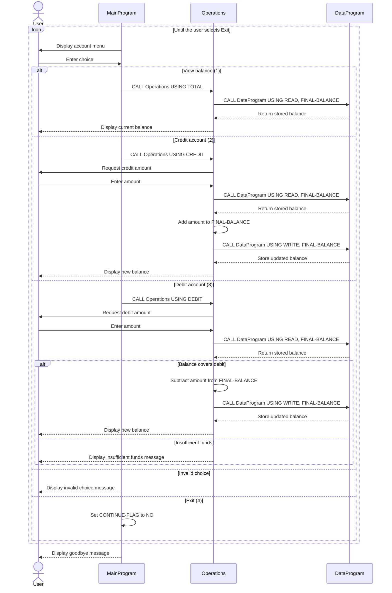

# Student Account Management System

This COBOL application provides a console-based interface for viewing and changing a student account balance. The program is split into a user interface, account operations, and balance storage.

## COBOL Files

### `src/cobol/main.cob`

`MainProgram` is the interactive entry point. It:

- Displays the account management menu.
- Reads the user's choice.
- Dispatches requests to `Operations`:
  - `1` calls `Operations` with `TOTAL ` to view the balance.
  - `2` calls `Operations` with `CREDIT` to add funds.
  - `3` calls `Operations` with `DEBIT ` to subtract funds.
  - `4` exits the application.
- Displays an error for choices outside the range `1` through `4`.

The menu repeats until the user selects exit.

### `src/cobol/operations.cob`

`Operations` contains the account business operations. It accepts a six-character operation code and handles:

- `TOTAL `: Reads and displays the current balance.
- `CREDIT`: Reads the current balance, adds the entered amount, saves the result, and displays the new balance.
- `DEBIT `: Reads the current balance, checks available funds, and saves the reduced balance when the debit is allowed.

The program uses `DataProgram` for all balance reads and writes, so it does not directly manage the storage value.

### `src/cobol/data.cob`

`DataProgram` provides the balance storage service. It accepts an operation code and a balance through the linkage section:

- `READ`: Copies the stored balance into the caller's balance field.
- `WRITE`: Replaces the stored balance with the caller's balance.

The stored balance is initialized to `1000.00` when the program is loaded. The storage is held in working storage, so it is in-memory state rather than durable file or database storage.

## Account Business Rules

- A new account starts with a balance of `1000.00`.
- Credits increase the balance by the amount entered.
- Debits decrease the balance only when the current balance is greater than or equal to the requested debit.
- A debit that exceeds the current balance is rejected and displays `Insufficient funds for this debit.`.
- A successful credit or debit is written back through `DataProgram` before the new balance is displayed.
- The balance and transaction amount use a six-digit whole-number field with two decimal places (`PIC 9(6)V99`), allowing values from `0.00` through `999999.99` within the COBOL field definition.
- The application does not currently validate that entered amounts are positive, non-zero, or within the representable range. Negative input, invalid input, and overflow behavior should be treated as implementation gaps rather than supported account rules.
- Balance state is lost when the program terminates because it is stored only in memory.

## Call Flow

```text
MainProgram
  -> Operations (TOTAL / CREDIT / DEBIT)
       -> DataProgram (READ)
       -> DataProgram (WRITE, for successful credits and debits)
```

Operation codes are six characters wide; the `TOTAL` and `DEBIT` calls include a trailing space to match the COBOL field definition.

## Application Sequence Diagram


